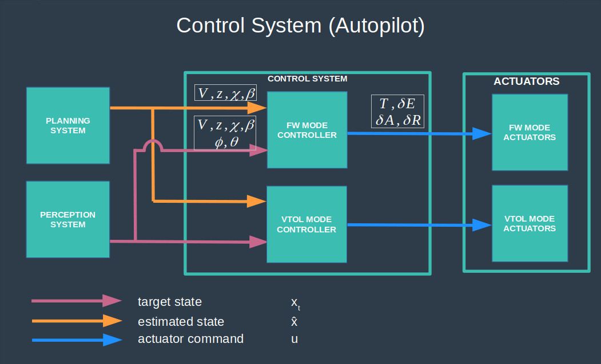
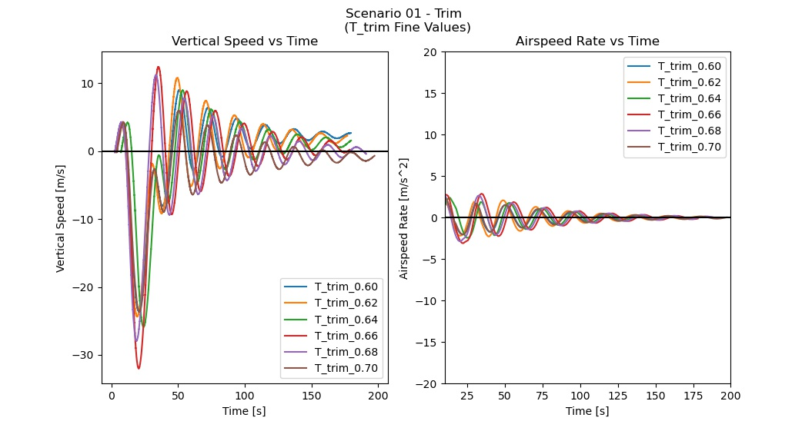

# Autonomous VTOL Control System

# Overview

This project develops a control system for an autonomous VTOL (vertical takeoff and landing) aircraft, provides a Python 3 implementation of this system and performs adjustments of the control system PID gains in a flight simulator.

The control system developed in this project is based upon a methodology by UDACITY [1].

This is an **optional** project part of Udacity's Autonomous Flight Engineer Nanodegree [2]. I am currently working on this project. **This README is a draft describing what has been done so far. It is not a final report.**

# Safety First!

1 - This project is educational only. The methodology developped in this project was only tested in the Udacity fixed wing flight simulator and not validated on a real aircraft.

2 - Only tune the parameters of your drone by following the procedure prescribed by your drone’s manufacturer.

3 - Make sure you comply with your local regulations before flying a drone.

4 - This project makes several assumptions which may not apply on a real aircraft.

# Install & Run

### Download this Repository

    mkdir -p /fcnd/projects/vtol_control
    cd /fcnd/projects/vtol_control
    git clone https://github.com/martin0004/autonomous_vtol_control_system.git

### Install the FCND Environment

This project requires the Udacity FCND Python environment, which can be installed with the following procedure.

1 - Install Anaconda.

    https://www.anaconda.com

2 - Download files for the Anaconda fcnd environment.

    mkdir -p /fcnd/environment
    cd /fcnd/environment
    git clone https://github.com/udacity/FCND-Term1-Starter-Kit.git

3 - Install the fcnd environment.

    Instructions in file: configure_via_anaconda.md.

### Install the Udacity Fixed Wing Flight Simulator (Unity)

1 - Create directory for the flight simulator.

    mkdir -p /fcnd/flight_simulators/fixed_wing
    cd /fcnd/flight_simulators/fixed_wing

2 - Download the flight simulator in the directory created above.

    https://github.com/udacity/FCND-FixedWing/releases

### Run a Simulation

1 - Launch the flight simulator (files might be different depending on your system).

    cd /fcnd/flight_simulators/fixed_wing/FCND-FlyingCar_Linux_64
    ./FCND-FlyingCar_Linux_64-bit

2 - Select a scenario in the picklist on the left (e.g. "12: Fixed Wing Challenge").

3 - Click on "Run Python Code".

4 - Open a terminal outside the simulation and start the fcnd environment.

    source activate fcnd

5 - In the same terminal window, run the following code so the Python autopilot can communicate with the simulator (-12 is the scenario number, use a different number if running another scenario).

    python fixed_wing_project.py -12

6 - Voilà! The VTOL will now follow the trajectory autonomously. Enjoy!

### [Optional] Udacity Starter Code

Udacity provided students with some starter code. This starter code can be installed with the following procedure.

	mkdir -p /fcnd/projects/vtol_control/udacity_starter_code
	cd /fcnd/projects/vtol_control/udacity_starter_code
	git clone https://github.com/udacity/FCND-FixedWing.git

# Udacity Fixed Wing Flight Simulator (Unity)

Parameters of the system developed in this project were tweaked by flying a VTOL in a series of scenarios in the Udacity fixed wing flight simulator [3]. The tuning scenarios and methodology are described in section “Validation”.

The flight simulator itself is a Unity application. A Python 3 API named `udacidrone` allows to communicate with the flight simulator [4]. See reference [3] for more information on running the simulator.

| Simulator Command              | Keystroke             |
|--------------------------------|-----------------------|
| **Generic Commands**           |                       |
| Switch flight mode (VTOL/FW)   | T                     |
| Zoom                           | MOUSE SCROLL          |
| **FW Flight Mode**             |                       |
| Forward velocity (throttle)    | C / SPACE             |
| Pitch control (elevator)       | UP / DOWN or W / S    |
| Roll control (aileron)         | LEFT / RIGHT or A / D |
| Yaw control (rudder)           | Q / E                 |
| **VTOL Flight Mode**           |                       |
| Up / down velocity (throttle)  | C / SPACE             |
| Pitch control / forward speed  | UP / DOWN or W / S    |
| Roll control                   | LEFT / RIGHT or A / D |
| Yaw control                    | Q / E                 |

# Symbols

### Units

| Units        | Description            |
|--------------|------------------------|
| m            | Distance.              |
| kg           | Mass.                  |
| s            | Time.                  |
| Hz           | Rate (frequency).      |
| rad          | Angle (radian).        |
| deg          | Angle (degree).        |
| rpm          | Rotation per minute.   |

### Accronyms

| Acronyms | Description                                                      |
|----------|------------------------------------------------------------------|
| CG       | Center of gravity.                                               |
| FCND     | Udacity's Autonomous Flight Engineer and Flying Car Nanodegree.  |
| FRD      | Front-Right-Down coordinate frame (VTOL body frame.)             |
| FW       | Fixed wing aircraft.                                             |
| NED      | North-East-Down coordinate frame.                                |
| VTOL     | Vertical takeoff and landing aircraft.                           |
| GPS      | Global positioning system.                                       |
| wrt      | Abbreviation for “with respect to”.                              |

### Variables

| Physical Constants | Value                | Description                 |
|--------------------|----------------------|-----------------------------|
| g                  | 9.81 m/s2 | Gravitational acceleration. |

| State Variables | Description                                     |
|-----------------|-------------------------------------------------|
| x (*)           | State vector.                                   |
| x (*)           | Position along x - NED frame.                   |
| y               | Position along y - NED frame.                   |
| z               | Position along z - NED frame (negative UP).     |
| u               | Speed along x - NED frame.                      |
| v               | Speed along y - NED frame.                      |
| w               | Speed along z - NED frame (negative UP).        |
| Ф               | Attitude about x - NED frame.                   |
| θ               | Attitude about y - NED frame.                   |
| ψ               | Attitude about z - NED frame.                   |
| p               | Body rate about x - body frame.                 |
| q               | Body rate about y - body frame.                 |
| r               | Body rate about z - body frame.                 |

(*) Depending on the context, it will be obvious if x represents a vector or a position.

| Control Variables | Description                                                                  |
|-------------------|------------------------------------------------------------------------------|
| kp,x   | Proportional gain for controller input variable x.                           |
| ki,x   | Integral gain for controller input variable x.                               |
| kd,x   | Derivative gain for controller input variable x.                             |
| Ttrim  | Thrust which keeps the aircraft in a level flight without an elevator input. |
| xmin</min>   | Minimum allowable value for variable x.                                      |
| xmax</min>   | Maximum allowable value for variable x.                                      |

# Robotic Architecture

The autonomous VTOL in this project uses the classical perception, planning and control architecture.

This project focuses on developing the **control** system (autopilot). The **actuators**, **sensors** and **process** (vehicle) are already implemented in the Udacity fixed wing simulator used in this project [3]. The **perception** and **planning** systems are also part of the simulator. A series of predefined trajectories will feed waypoints to the control system during each simulation scenario.

# Process (Vehicle)

### Overview

The vehicle in this project is an hybrid aircraft able to take off vertically and fly horizontally like an airplane. This aircraft is implemented in a flight simulator and is very similar to the Kitty Hawk Cora aircraft. [KITTY-HAWK]

| Kitty Hawk Cora Aircraft                                      | Hybrid Aircraft in this Project   (Simulator)                   |
|---------------------------------------------------------------|--------------------------------------------------------------------|
|  |  |

### Flight Modes

The vehicle is able to operate in 3 flight modes.

- A fixed wing flight mode (FW). In this mode, the aircraft flies like a regular aircraft.
- A vertical takeoff and landing flight mode (VTOL). This mode is designed to allow the vehicle to take-off/land vertically, without a runway.
- An hybrid flight mode, which manages the transition between the FW and VTOL modes.

| VTOL Flight Mode                                                  | FW Flight Mode                                                  |
|-------------------------------------------------------------------|-----------------------------------------------------------------|
|  |  |

### Coordinate Frames

##### Overview

This project uses the following coordinate frames and locations, which are the same as in the Udacity fixed wing simulator [3]. Each frame is associated to a label which may be used as a variable prefix in the code, thus specifying which frame the variable values are expressed in.

##### GPS Frame

| Name        | GPS Frame                                                      |
|:------------|:---------------------------------------------------------------|
| Description | Coordinate frame used by the global positionning system.       |
| Label       | gps                                                            |
| X Axis      | Longitude [deg]                                                |
| Y Axis      | Latitude [deg]                                                 |
| Z Axis      | Altitude [m] - POSITIVE above ground                           |
| Origin      | Location at sea level, off the coast of Africa.                |
| Comments    | Referred to as the "Global Frame" in the `udacidrone` API [4]. |
|             | Referred to as the "Geodetic Frame" in the lectures [2].       |

##### NED Frame

| Name        | NED Frame                                                        |
|:------------|:-----------------------------------------------------------------|
| Description | Local North-East-Down inertial coordinate frame.                 |
| Label       | ned                                                              |
| X Axis      | Points north.                                                    |
| Y Axis      | Points east.                                                     |
| Z Axis      | Points down -> altitude NEGATIVE above ground                    |
| Origin      | Drone home location.                                             |
| Comments    | Referred to as the "Local Frame" in the `udacidrone` API [4].    |
|             | Coordinates in the simulator GUI are expressed in the NED frame. |
|             | |

##### Body Frame

| Name        | Body Frame                                                     |
|:------------|:---------------------------------------------------------------|
| Description | FRD coordinate frame attached to the aircraft.                 |
|             | Moves as the vehicle moves.                                    |
| Label       | body                                                           |
| X Axis      | Points forward of vehicle.                                     |
| Y Axis      | Points right of vehicle (starboard).                           |
| Z Axis      | Points downwards wrt vehicle.                                  |
| Origin      | Vehicle CG.                                                    |
|             | |

##### Home Location

| Name        | Home Location                                                  |
|:------------|:---------------------------------------------------------------|
| Description | Point wrt to which the vehicle derives its position.           |
|             | Used as the NED origin.                                        |
| Label       | home                                                           |
| Coordinates | gps: -122.3974500, 37.7924800, 0.0000000                       |
|             | ned: 0.0, 0.0, 0.0                                             |
| Comments    | Refered to as "Global Home" in `udacidrone` API [4].           |
|             | Can be extracted from log file.                                |
|             | The figure below shows the approximate position of the home location wrt the world surrounding landscape. Fun fact: in the real world these GPS coordinates correspond more or less to the center of the Golden Gate Bridge. Google it!                               |
|             | |

##### Rotation Matrix

(to do... add in Python implementation too)

# Actuators

The vehicle actuators are devided into 2 categories (FW mode actuators and VTOL mode actuators) depending on the flight mode they are associated with. See section "Control System - Actuator Commands" for the actuators associated commands.

# Sensors

(to do...)

# Control System (Autopilot)

### Overview

The figure below provides a top-level view of the control system developped in this project.

The control system is composed of two main controllers.

- The FW mode controller manages longitudinal & lateral flight commands when the aircraft is in FW mode. This controller sends commands to the FW mode actuators (rear propeller, elevator, ailerons and rudders).
- The VTOL mode controller manages take-off/landing flight commands when the aircraft is in VTOL mode. This controller sends commands to the VTOL mode actuators (the 12 vertical propellers of the vehicle).

### Assumptions

The control system developped in this project makes the following assumptions.

1 - There is no wind in the simulator.
2 - ...

### Actuator Commands & Limitations

The table below describes the actuator commands which come out of the control system and their min/max limitations.

Notes.
- Actuator commands are expressed as a relative value of their min/max real values.
    - Example: if the real thrust max allowable value is 10000 N, a relative command thrust of 0.5 means the real commanded thrust will be 5000 N.
- The project documentation did not provide info about the actuators real min/max values, only these relative values are used.
- The command sign convention is the same as the state variable they are trying to control.
    - Example: a positive elevator command δE will induce a positive pitch angle.

| Actuator                | Command             | Symbol  | Min/Max   (Relative Values) |
|-------------------------|---------------------|---------|--------------------------------|
| **FW Mode Actuators**   |                     |         |                                |
| Rear Propeller          | Thrust              | T       |  0.00 / 1.00                   |
| Elevator                | Elevator Deflection | δE      | -1.00 / 1.00                   |
| Aileron                 | Aileron Deflection  | δA      | -1.00 / 1.00                   |
| Rudder                  | Rudder Deflection   | δR      | -1.00 / 1.00                   |
| **VTOL Mode Actuators** |                     |         |                                |
| Vertical Propellers     | Thrust              | (to do) | (to do)                        |
|                         | Roll                | (to do) | (to do)                        |
|                         | Pitch               | (to do) | (to do)                        |
|                         | Yaw                 | (to do) | (to do)                        |

### FW Mode Controller

(to do...)

### VTOL Mode Controller

(to do..)

# Implementation in Python

### Overview

The control system (autopilot) developped above was implemented in Python. (talk about the main implementation files and the Udacity skeleton).

### Telemetry Logging

Whenever a scenario is ran with the Python script, telemetry data is automatically saved into file `control_system/logs/tlog.txt`. An example of telemetry output is provided below.

The following telemetry messages were of particular interest for this project. Description for all messages can be found by diving into the `udacidrone` source files [4].

| Telemetry Message     | Description                    | Field 1 | Field 2  | Field 3   | Field 4                |
|-----------------------|--------------------------------|---------|----------|-----------|------------------------|
| MsgID.GLOBAL_HOME     | VTOL home location - GPS Frame | time    | latitude | longitude | altitude (positive UP) |
| MsgID.GLOBAL_POSITION | VTOL position - GPS Frame      | time    | latitude | longitude | altitude (positive UP) |
| MsgID.LOCAL_POSITION  | VTOL position - NED Frame      | time    | x        | y         | z (negative UP)        |
| MsgID.LOCAL_VELOCITY  | VTOL velocity - NED Frame      | time    | u        | v         | w (negative UP)        |

Notes

- This file gets overwritten whenever a new scenario is launched. Make sure to copy a log elsewhere following a simulation.
- Make sure you close & reopen the simulator every time you want to log data. This will reset the "time" field to 0.
- There is a lag between the beginning of a simulation and the time data starts to be saved to log. This may result into a plateau of 0's at the beginning of a log file. For this reason, the first 5-10 seconds of data log may not be plotted on some charts in this report.
- There is also a lag of ~10 s between the simulator and the data logging. Make sure you let the simulator run ~10 s longer than the number of seconds you want to capture in the log.

### Command Limitations, PID Gains, Integral Terms

Command limitations, PID gains & integral terms required by the controllers are implemented as static variables in the `__init__` method of the `LongitudinalAutoPilot`, `LateralAutoPilot` and `VerticalAutoPilot` classes.

# Validation in Udacity Fixed Wing Flight Simulator

### Overview

The control system (autopilot) described above was validated in the Udacity fixed wing flight simulator [3]. System parameters - mostly PID gains - were tuned in a series of scenarios of incremental complexity. Scenarios were divided into 3 categories.

- Fixed Wing Mode - Longitudinal Control Scenarios
- Fixed Wing Mode - Lateral Control Scenarios
- Vertical Take-Off & Landing - Vertical Control Scenarios

Scenarios within the same category were built on one another: parameters tuned in a scenario were active in any subsequent scenario. 

|  Scenarios                                  | Controller(s)              | Parameter(s)   PID Gain(s)    |
|---------------------------------------------|----------------------------|----------------------------------|
| **FW Mode - Longitudinal Control Scenarios**                                                                |
| Scenario 1 - Trim                           | ?????                      | Ttrim</trim>                |
| Scenario 2 - Altitude Hold                  | Pitch Hold                 | kp,θ, kd,θ |
|                                             | Altitude Hold (with Pitch) | kp,z, kd,z |
| Scenario 3 - Airspeed Hold                  | x                          | x                                |
| Scenario 4 - Steady Climb                   | x                          | x                                |
| Scenario 5 - Longitudinal Challenge         | x                          | x                                |
| **FW Mode - Lateral Control Scenarios**                                                                     |
| Scenario 6 - Stabilized Roll Angle          | x                          | x                                |
| Scenario 7 - Coordinated Turn               | x                          | x                                |
| Scenario 8 - Constant Course/Yaw Hold       | x                          | x                                |
| Scenario 9 - Straight Line Following        | x                          | x                                |
| Scenario 10 - Orbit Following               | x                          | x                                |
| Scenario 11 - Lateral/Directional Challenge | x                          | x                                |
| Scenario 12 - Full 3D Challenge             | x                          | x                                |
| **VTOL - Vertical Control Scenarios**                                                                       |
| Scenario 13 - Flying Car Challenge          | x                          | x                                | 

### Scenario 1 - Trim

##### Objective(s)

- Find a fixed throttle Ttrim which provides level flight with very little oscillations with no elevator input (this value will be reused in the XXXXX controller as a throttle feed-forwarding value).

##### Success Metric(s)

- Vertical speed must be less than 0.5 m/s for 5 s.
- Airspeed rate must be less than 0.1 m/s2 for 5 s.

##### Scenario Description

- The aircraft tries to maintain a level flight.
- Only thrust commands T can be sent to the vehicle.
- VTOL initial conditions
    - Altitude: 450 m.
    - Airspeed: 40 m/s.
    - Thrust: 0.70.

##### Methodology & Analysis

- A series of thrust values Ttrim were tested in the simulator, each simulation was ~200 s long.

- Note that there was a mountain ridge in the simulator about 60 s ahead of the plane initial location. For this reason, at the start of every simulation the VTOL thrust was initially set to 0.90 to bing the aircraft at ~700 m altitude. Once at this altitude, the thrust was reduced to the value of interest for the simulation. This altitude change period took about 30-45 s, which explains the first peaks in the charts below.

- The scenario was ran with a first batch of "coarse" thrust values: Ttrim = 0.50, 0.60, 0.70, 0.80 and 0.90. From this first batch, we could observe the following.
    - The vertical speed will converge to 0 if 0.60 < Ttrim < 0.70.
    - The airspeed rate will converge to 0 for all Ttrim.

 - A second batch of "fine" thrust values was then tested: Ttrim = 0.62, 0.64, 0.66 and 0.68.
    - Ttrim = 0.68 met the success metrics after ~190 s.

    

##### Results

Ttrim = 0.68 meets the trim requirements.

| Before Stabilization   Ttrim = 0.68 | After Stabilization   Ttrim = 0.68 |
|--------------------------------------------|-------------------------------------------|
|  |  |

### Scenario 2 - Altitude Hold

##### Objective(s)

- Implement the altitude hold (with pitch) and pitch hold controllers.

##### Success Metric(s)

- Altitude must reach the target altitude (450 m ± 3 m) in less than 10 s.
- Altitude must remain within the target altitude bound for 5 s.

##### Scenario Description

(to do...)

##### Methodology & Analysis

- The pitch hold controller was implemented in class `LongitudinalAutoPilot` method `pitch_loop`. This controller was implemented & tuned first since it is an inner controller.
    - Selected kp,θ = ...
    - Selected kd,θ = ...

(graphs)

- Then, the altitude hold (with pitch) controller was implemented in class `LongitudinalAutoPilot` method `altitude_loop`.
    - Selected kp,z = ...
    - Selected ki,z = ...

(graphs)

##### Results

- Selected kp,θ = ...
- Selected kd,θ = ...
- Selected kp,z = ...
- Selected ki,z = ...

| Before Tuning                              | After Tuning                              |
|--------------------------------------------|-------------------------------------------|
| (video) | (video) |

(success metrics)

# Possible Improvements

- As mentionned in the "Possible Improvements" of the quadcopter controls project of this nanodegree [PROJECT-3], one thing to explore would be to "encapsulate" the flight simulator in a reinforcement learning algorithm which would tune automatically the control gains.

# References

[1] UDACITY, Fixed Wing Aircraft Equations of Motion Cheat Sheet, https://www.overleaf.com/read/cvqmtzyhqjnj

[2] Udacity's Autonomous Flight Engineer Nanodegree. https://www.udacity.com/course/flying-car-nanodegree--nd787

[3] Udacity, Fixed Wing Flight Simulator (Unity), github, https://github.com/udacity/FCND-FixedWing/releases

[4] Udacity, udacidrone API documentation, https://udacity.github.io/udacidrone/docs/welcome.html

[KITTY-HAWK] Kitty Hawk Corporation, https://kittyhawk.aero/

[PROJECT-3] Martin Cote, Autonomous Drone Control System - Autonomous Flight Engineer Nanodegree - Project #3, https://github.com/martin0004/drone_control_system

